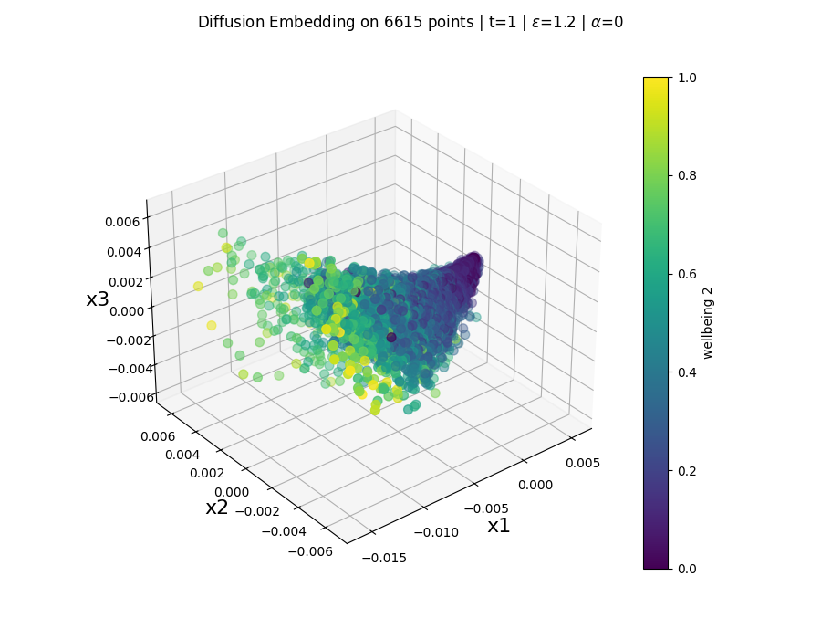

# well-being-diffusion-maps [[1]](#references)


Code Organization
-----------------

```bash
    ├── data/                               #dataset                        
        └── dataset (.sav file)
    ├── out/                                #output folder
        ├── density-conjecture/
        └── diff-maps-embedding/             
    └── src/                                # source code
```

# Running the code
This code uses the Sacred [[2]](#references) framework for experiment management. Python version 3.10.13.

**running** `main.py` will run the algorithm with the parameters set in the `forward_main` configuration of the `dataset_ingredient` (dataset.py) and 
the configuration presets in `diffusion_maps.py` and `main.py` files per the Sacred framework.

running all welfare regimes:

``python main.py with dataset.all_welfare_regimes_forward``

`with` is the Sacred command for running configurations.


## References
[1] Ronald R. Coifman and Stéphane Lafon. "Diffusion maps." *Applied and Computational Harmonic Analysis*, Volume 21, Issue 1, 2006, Pages 5-30. https://doi.org/10.1016/j.acha.2006.04.006

[2] Klaus Greff, Aaron Klein, Martin Chovanec, Frank Hutter, and Jürgen Schmidhuber. "The Sacred Infrastructure for Computational Research." *Proceedings of the 16th Python in Science Conference*, 2017. http://conference.scipy.org/proceedings/scipy2017/klaus_greff.html

